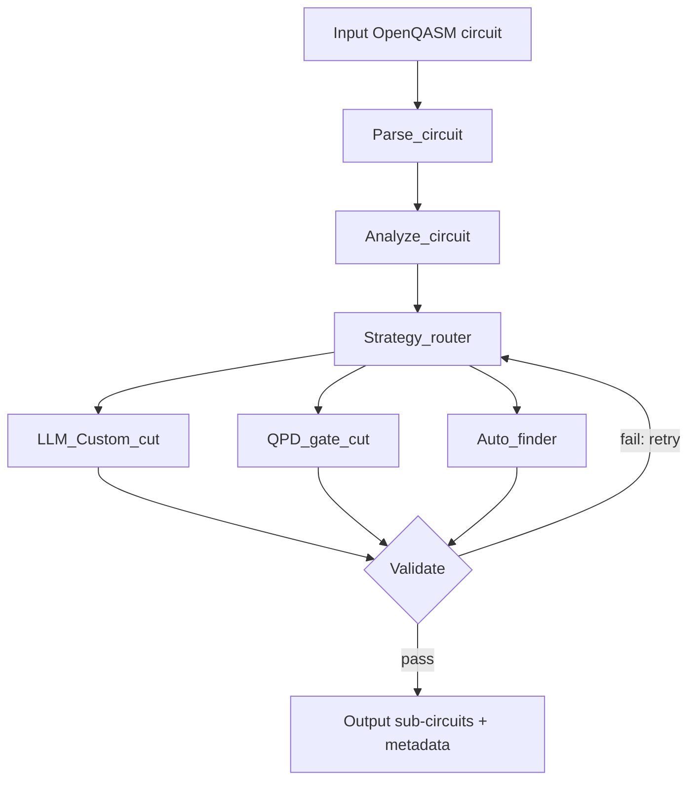

# GRACE: Generative Resilient Automatic Circuit-Cutting Engine

An agentic [LangGraph](https://github.com/langchain-ai/langgraph) pipeline that asks an off-the-shelf LLM to cut quantum circuits into sub-circuits small enough for current hardware, then falls back to established deterministic cutting strategies when the LLM's cut fails validation.

> **Paper:** [*Large Language Models for Quantum Circuit Cutting and Optimization*](paper/GRACE_paper.pdf) (unpublished manuscript; Laney, Conner, Moin).

> **Headline result:** a rigorous negative finding. On 150 MQT Bench circuits, LLM-guided GRACE matched but did not beat a deterministic-only baseline (45.6% vs. 45.1% genuine pass rate, not statistically significant).

## Why this exists

Quantum hardware is limited in qubit count, so large circuits must be split into smaller sub-circuits whose results are recombined classically. Classical post-processing cost grows exponentially with the number of cuts (a single CNOT/CZ cut costs a 9x sampling overhead via quasi-probability decomposition). Existing cut-finders rely on hard-coded heuristics or domain-specific training. GRACE tests whether an off-the-shelf LLM, used as an orchestrator rather than a fine-tuned partitioner, can do better.

## How it works



- **First attempt is always `LLM_Custom_cut`.** If it fails validation, the router (LLM-assisted, with a deterministic backstop) chooses among the remaining strategies and never re-selects a failed one.
- **Deterministic backends:** `qpd_gate_cut` (QPD gate cutting from the Qiskit circuit-cutting addon) and `auto_finder` (`find_cuts()` best-first search).
- **Validation:** structural, channel, and reconstruction checks. Reconstructed expectation values are compared to exact statevector values using a coefficient-aware tolerance.
- **Feasibility gate:** a fitted cost model estimates validation time (it grows exponentially with cut count) and skips runs that would exceed a budget.

## Key results

150 circuits, 15 MQT Bench families, 3 to 12 qubits, 3 seeded trials per configuration (seeds 101, 202, 303).

| Configuration | Mean genuine pass rate | Circuits (mean ± σ) |
|---|---|---|
| Deterministic-only baseline | 45.1% | 67.7 ± 0.6 |
| LLM-enabled GRACE | 45.6% | 68.3 ± 1.2 |

- Difference is not significant (McNemar's exact test p = 0.50; Wilcoxon signed-rank p = 0.50). Only 2 discordant pairs out of 450, so power is limited.
- The LLM's first-attempt cut passes validation on ~26% of circuits; ~74% are recovered by deterministic fallbacks, and no circuit is solved exclusively by the LLM's own cuts.
- Both configurations are highly reproducible (96.7% and 98.7% identical outcomes across seeds).
- The dominant bottleneck is exponential validation cost with cut count, independent of strategy selection.

See the paper for the full tables, failure-mode analysis, and threats to validity.

## Repository layout

```
.
├── paper/                   # project manuscript
│   └── GRACE_paper.pdf
├── grace/                   # pipeline source (run scripts from inside this folder)
│   ├── subgraph.py          # builds and runs the LangGraph pipeline on one circuit
│   ├── parse_node.py        # Node 1: load OpenQASM, summarize
│   ├── analyze_node.py      # Node 2: circuit metrics + LLM analysis
│   ├── strategy_router.py   # Node 3: strategy selection and retry policy
│   ├── auto_finder.py       # Node 4: find_cuts() backend
│   ├── llm_custom_cut_node.py  # Node 5: LLM-proposed cutting plan
│   ├── gate_cutting_node.py # Node 6: QPD gate cutting
│   ├── wire_cutting_node.py # shared cutting machinery used by Node 5
│   ├── validate_node.py     # Node 7: equivalence validation
│   ├── validation_cost_model.py
│   ├── inspection_export.py # per-run export of circuits and metadata
│   ├── llm_client.py        # OpenRouter client
│   ├── batch_test.py        # benchmark harness
│   ├── batch_worker.py      # one-circuit subprocess used by the harness
│   └── fetch_mqt_circuits.py# generate MQT Bench circuits as OpenQASM 2.0
├── .env.example
├── requirements.txt
└── README.md
```

## Installation

```bash
git clone https://github.com/<owner>/<repo>.git
cd <repo>
python -m venv .venv
source .venv/bin/activate        # Windows: .venv\Scripts\activate
pip install -r requirements.txt

cp .env.example .env             # then add your own OpenRouter key
```

An [OpenRouter](https://openrouter.ai) API key is only needed for LLM calls. The default model is `deepseek/deepseek-v4-flash` (see `grace/llm_client.py`). Never commit your `.env` file.

## Quickstart: cut one circuit

```bash
cd grace
python fetch_mqt_circuits.py --out benchmarks_smoke --min-qubits 3 --max-qubits 6
python subgraph.py benchmarks_smoke/ghz_n5.qasm
```

Per-run outputs (original, marked and cut circuits, sub-circuits, and metadata including sampling overhead) are written to `cutting_runs/`.

## Reproducing the benchmark

```bash
cd grace
python fetch_mqt_circuits.py --out benchmarks --all --min-qubits 3 --max-qubits 12

# LLM-enabled GRACE (one run per seed)
GRACE_AUTOFINDER_SEED=101 python batch_test.py --circuits benchmarks --results-dir results_llm_s101

# Deterministic-only baseline
GRACE_AUTOFINDER_SEED=101 python batch_test.py --circuits benchmarks --results-dir results_nollm_s101 --no-llm
```

Repeat with seeds 202 and 303. The harness is resumable: circuits that already reached a terminal status are skipped on restart. A full 150-circuit run takes roughly 6 hours. Run `python batch_test.py --help` for timeouts, validation budget, and worker options.

## Limitations

- MQT Bench circuits at 3 to 12 qubits only; exact statevector validation sets a hard qubit ceiling.
- OpenQASM 2.0 and Qiskit only.
- Three seeded trials is underpowered for small effects; the result is "no benefit detected," not proof of equivalence.
- The mandatory LLM-first policy conflates the LLM's own cut quality with its routing side effects; a controlled ablation is future work.

## Citation
```bibtex
@misc{laney2026grace,
  title  = {Large Language Models for Quantum Circuit Cutting and Optimization},
  author = {Laney Ezekiel, Conner Michael, Moin Armin},
  year   = {2026}
}
```

This citation will be updated if the manuscript is later published or assigned an arXiv identifier or DOI.

## Acknowledgments

Developed at the QAS Lab, University of Colorado Colorado Springs, as part of an NSF-funded REU. This material is based upon work supported by the U.S. National Science Foundation under Grant No. 2349452. Any opinions, findings, and conclusions or recommendations expressed are those of the authors and do not necessarily reflect the views of the NSF.


